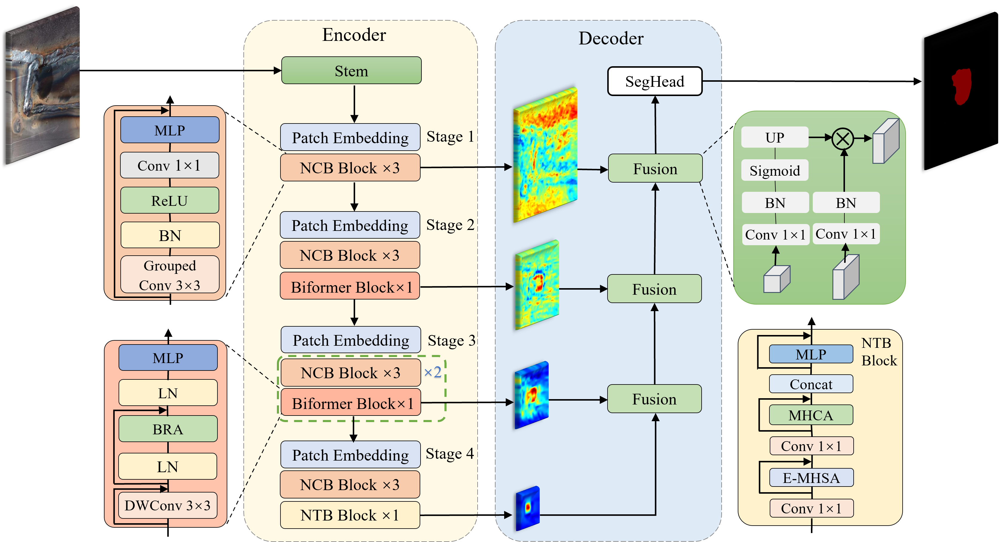
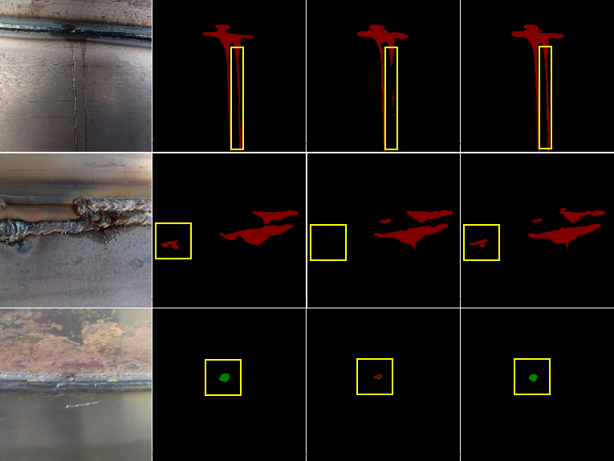
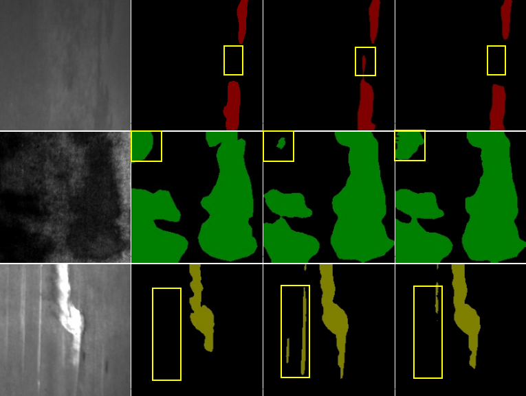
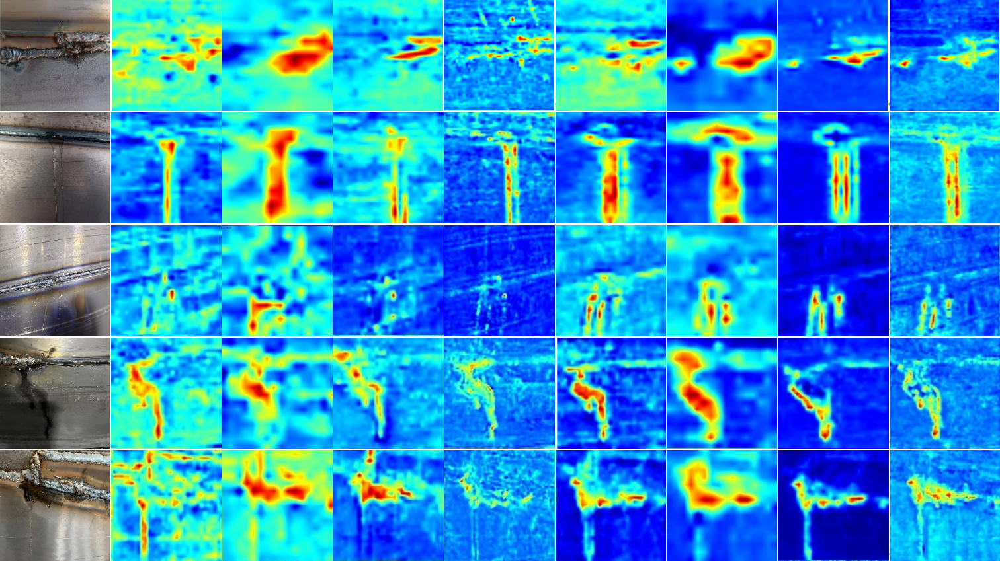
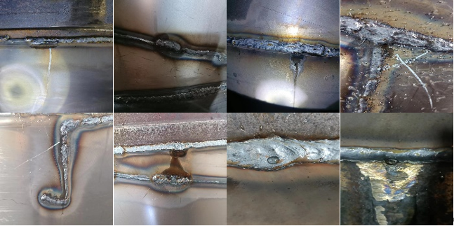

# WDA-Net
**PyTorch implementation of "*Weak Appearance Aware Hybrid Architecture for Leakage Defect Detection*".**<br><br>

## *Highlights:*
#### 1. *we propose a hybrid semantic segmentation network (named WDA-Net) to achieve pipeline leakage detection.* 

  <p align="center"> </p>
 
#### 2. *Our WDA-Net achieves state-of-the-art performance on the PLD dataset.*
  <p align="center"> </p>
  <p align="center"> </p>
  <p align="center"> </p>

#### 3. *we proposed a new dataset named PLD for pipeline leakage semantic segmentation .*
  <p align="center"> </p>

## Benchmark and model zoo
 
|  Model   |    Dataset    | img_size | mIoU  |                                  Download                                   |
|:--------:|:-------------:|:--------:|:-----:|:---------------------------------------------------------------------------:|
| WDA-Net  |      PLD      | 512x512  | 70.04 |      [model](https://pan.baidu.com/s/1wbT51K_U8y2FPOZxoqVg4A?pwd=0929)      |
| WDA-Net  |    NEU-Seg    | 192x192  | 85.07 |      [model]()      |

The PLD test set is available at  [<a href="https://pan.baidu.com/s/1CGnnoqhFWnILYi-fUOl1Zg?pwd=0929">DataSet</a>]. 


## Installation

The code was tested on SUSE Linux, with [Anaconda](https://www.anaconda.com/download) Python 3.8 and [PyTorch]((http://pytorch.org/)) v1.10.0. NVIDIA GPUs are needed for both training and testing.
After installing Anaconda:


a. Create a conda virtual environment and activate it.

```shell
conda create -n WDA-Net python=3.8 -y
conda activate WDA-Net
```

b. Install PyTorch and torchvision following the [official instructions](https://pytorch.org/).
Here we use PyTorch 1.10.0 and CUDA 11.1.
You may also switch to other version by specifying the version number.

```shell
conda install pytorch=1.10.0 torchvision -c pytorch
```

c. Install [MMCV-full 1.5.0](https://mmcv.readthedocs.io/en/latest/) following the [official instructions](https://mmcv.readthedocs.io/en/latest/#installation).

```shell
pip install mmcv-full -f https://download.openmmlab.com/mmcv/dist/{cu_version}/{torch_version}/index.html
```


d. Install MMSegmentation.

```shell
pip install mmsegmentation 
```
or
```shell
pip install git+https://github.com/open-mmlab/mmsegmentation.git 
```
## Train a model

#### Train with a single GPU
```shell
sh tools/dist_train.sh ${CONFIG_FILE} 1 [optional arguments]
```

#### Train with multiple GPUs

```shell
sh tools/dist_train.sh ${CONFIG_FILE} ${GPU_NUM} [optional arguments]
```
## eval a model

```shell
sh tools/dist_test.sh ${CONFIG_FILE} 1 [optional arguments]
```

